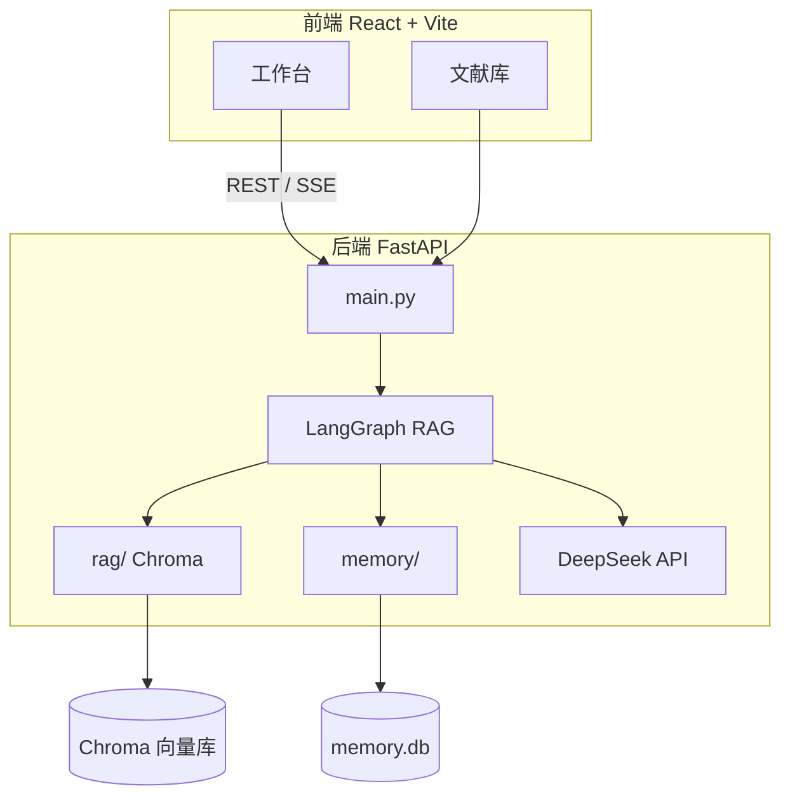

# 文献处理 Agent

基于 **React + FastAPI + LangGraph** 的学术文献智能处理应用，支持上传 PDF/Word、结构化抽取、相似文献检索，以及带 **Human-in-the-Loop** 的 Agentic RAG 文献问答。

## 功能概览

| 模块 | 说明 |
|------|------|
| **摘要提炼** | 结构化提取背景、目的、方法、发现、创新点等 |
| **学术翻译** | 中英等多语言学术文献互译 |
| **润色优化** | 优化语法、用词与学术表达 |
| **信息抽取** | 抽取标题、作者、DOI、方法、数据集、指标等字段 |
| **相似文献** | 基于 Semantic Scholar + MCP 推荐相关论文 |
| **文献问答** | LangGraph Agent：规划 → 检索 → 评估 → 作答 |
| **Human-in-the-Loop** | 检索计划与引用片段两处人工确认，可修改/补充检索 |
| **记忆系统** | 短期 Session/Checkpoint + 长期 SQLite 跨会话上下文 |
| **文献库** | 本地保存抽取结果，支持批量导出 |

## 架构



**文献问答 Agent 流程（LangGraph）：**

```
plan → plan_review → retrieve → grade ⇄ retrieve_more → answer_review → prepare_answer → 流式作答
         ↑ HITL              ↑ 评估循环                    ↑ HITL
```

## 技术栈

| 层级 | 技术 |
|------|------|
| 前端 | React 19、TypeScript、Vite、Tailwind CSS |
| 后端 | FastAPI、Uvicorn、Pydantic Settings |
| Agent | **LangGraph**（StateGraph + interrupt HITL） |
| LLM | DeepSeek Chat API |
| 向量库 | ChromaDB（本地持久化，`all-MiniLM-L6-v2`） |
| 记忆 | JSON Session + SQLite 长期记忆 |
| 文档 | PyMuPDF、python-docx、reportlab |
| 外部检索 | Semantic Scholar、MCP（FastMCP） |

## 快速开始

### 1. 配置环境变量

```powershell
cd backend
copy .env.example .env
```

编辑 `backend/.env`，至少填入 DeepSeek API Key：

```env
DEEPSEEK_API_KEY=sk-xxx
DEEPSEEK_BASE_URL=https://api.deepseek.com/v1
DEEPSEEK_MODEL=deepseek-chat
PORT=8001
```

> 首次建立 RAG 索引时会下载 Chroma 内置 embedding 模型（约 79MB），请保持网络畅通。

### 2. 启动后端

```powershell
cd backend
pip install -r requirements.txt
uvicorn app.main:app --reload --port 8001
```

### 3. 启动前端

```powershell
cd frontend
npm install
npm run dev
```

浏览器访问 http://localhost:5173

前端通过 Vite 代理将 `/api` 转发到 `http://localhost:8001`。

## 使用文献问答（RAG）

1. 切换到 **文献问答**，粘贴或上传 PDF/Word 全文
2. 点击 **建立索引**（写入 Chroma 向量库）
3. 输入问题；可选勾选 **Human-in-the-Loop**
4. HITL 模式下：确认检索计划 → 确认引用片段 → 流式生成回答

## 项目结构

```
Literature_Processing_Agent/
├── backend/
│   ├── app/
│   │   ├── main.py           # API 路由与 SSE
│   │   ├── llm.py            # DeepSeek 调用
│   │   ├── prompts.py        # 提示词
│   │   ├── config.py         # 环境配置
│   │   ├── documents.py      # PDF/Word 解析与导出
│   │   ├── extract.py        # 元数据抽取
│   │   ├── scholar.py        # Semantic Scholar
│   │   ├── mcp_server.py     # 学术检索 MCP Server
│   │   ├── rag/
│   │   │   ├── graph.py      # LangGraph 状态图（核心）
│   │   │   ├── common.py     # 规划/检索/评估工具
│   │   │   ├── chunk.py      # 文本分块
│   │   │   ├── store.py      # Chroma 向量库
│   │   │   ├── ingest.py     # 入库索引
│   │   │   ├── ask.py        # 检索与 Prompt
│   │   │   ├── agent.py      # RAG 入口（转发 graph）
│   │   │   └── hitl.py       # HITL 入口（转发 graph）
│   │   └── memory/
│   │       ├── store.py      # 记忆门面
│   │       ├── short_term.py # Session / Checkpoint
│   │       └── long_term.py  # SQLite 长期记忆
│   ├── data/                 # 本地数据（已在 .gitignore）
│   └── requirements.txt
└── frontend/
    └── src/
        ├── pages/            # 工作台、文献库
        ├── components/       # RagPanel、TaskTabs 等
        └── api/client.ts     # API 与 SSE 解析
```

## API 接口

### 基础任务

| 方法 | 路径 | 说明 |
|------|------|------|
| GET | `/api/health` | 健康检查 |
| POST | `/api/summarize` | 摘要提炼（SSE） |
| POST | `/api/translate` | 学术翻译（SSE） |
| POST | `/api/polish` | 润色优化（SSE） |
| POST | `/api/extract` | 信息抽取 |
| POST | `/api/similar-papers` | 相似文献检索 |
| POST | `/api/parse-document` | 上传解析 PDF/Word |
| POST | `/api/export` | 导出 docx / pdf |

### RAG 与记忆

| 方法 | 路径 | 说明 |
|------|------|------|
| POST | `/api/rag/index` | 建立向量索引 |
| GET | `/api/rag/documents` | 列出已索引文献 |
| DELETE | `/api/rag/documents/{doc_id}` | 删除索引 |
| POST | `/api/rag/ask` | Agentic 问答（SSE，可选 HITL） |
| POST | `/api/rag/ask/continue` | HITL 继续（approve / edit / refine / reject） |
| POST | `/api/memory/sessions` | 创建短期会话 |
| GET | `/api/memory/sessions/{id}/checkpoints` | 列出 checkpoint |
| POST | `/api/memory/sessions/{id}/restore/{ckpt}` | 回滚 checkpoint |
| GET | `/api/memory/long-term` | 长期记忆列表 |

RAG 问答请求示例：

```json
{
  "question": "本文使用了哪些数据集？",
  "doc_ids": ["..."],
  "session_id": "...",
  "human_in_the_loop": true,
  "save_to_long_term": true
}
```

## 环境变量

详见 `backend/.env.example`。常用项：

| 变量 | 说明 | 默认 |
|------|------|------|
| `DEEPSEEK_API_KEY` | DeepSeek API Key | — |
| `DEEPSEEK_MODEL` | `deepseek-chat` / `deepseek-reasoner` | `deepseek-chat` |
| `PORT` | 后端端口 | `8001` |
| `RAG_CHUNK_SIZE` | 分块大小（字） | `800` |
| `RAG_TOP_K` | 检索返回片段数 | `6` |
| `RAG_AGENT_MAX_ITERATIONS` | 最大补充检索轮次 | `2` |
| `MEMORY_SESSION_TTL_SECONDS` | 短期会话 TTL | `86400` |
| `SEMANTIC_SCHOLAR_API_KEY` | 可选，降低限流 | — |

## DeepSeek 模型

- `deepseek-chat` — 通用对话（默认）
- `deepseek-reasoner` — 推理模型

## 本地数据目录

运行时数据写入 `backend/data/`（勿提交 Git）：

| 路径 | 内容 |
|------|------|
| `data/chroma/` | 向量索引 |
| `data/sessions/` | 短期会话与 checkpoint |
| `data/memory/memory.db` | 长期记忆 |
| `data/uploads/` | 上传文件 |

> HITL 暂停状态由 LangGraph `MemorySaver` 保存在进程内存中；**服务重启后**未完成的 HITL 会话需重新提问。

## 部署到 Railway

1. 安装 CLI 并登录：

   ```bash
   npm i -g @railway/cli
   railway login
   ```

2. 在项目根目录初始化并配置密钥：

   ```bash
   railway init
   railway variables set DEEPSEEK_API_KEY=sk-xxx
   railway variables set DEEPSEEK_BASE_URL=https://api.deepseek.com/v1
   railway variables set DEEPSEEK_MODEL=deepseek-chat
   railway up
   railway domain
   ```

3. 访问 `/api/health`，确认 `api_configured` 为 `true`。

## 开发说明

- **Agent 编排**：`backend/app/rag/graph.py`（LangGraph `StateGraph`）
- **HITL**：LangGraph `interrupt()` + `Command(resume=...)`，`run_id` 即 `thread_id`
- **双角色**：Researcher（规划/检索/评估）、Analyst（最终作答）
